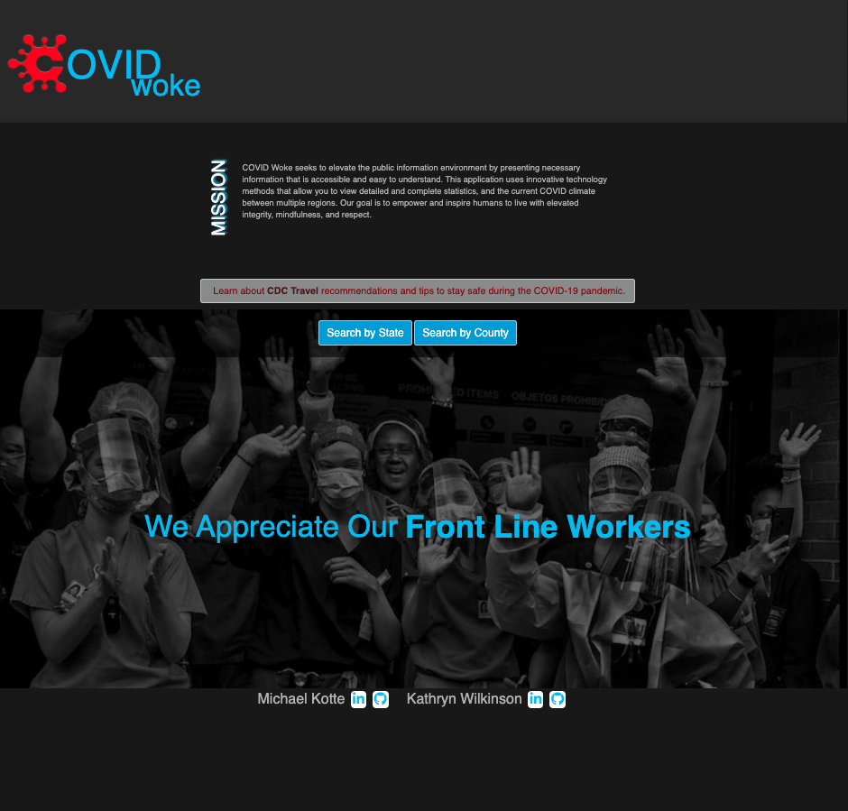
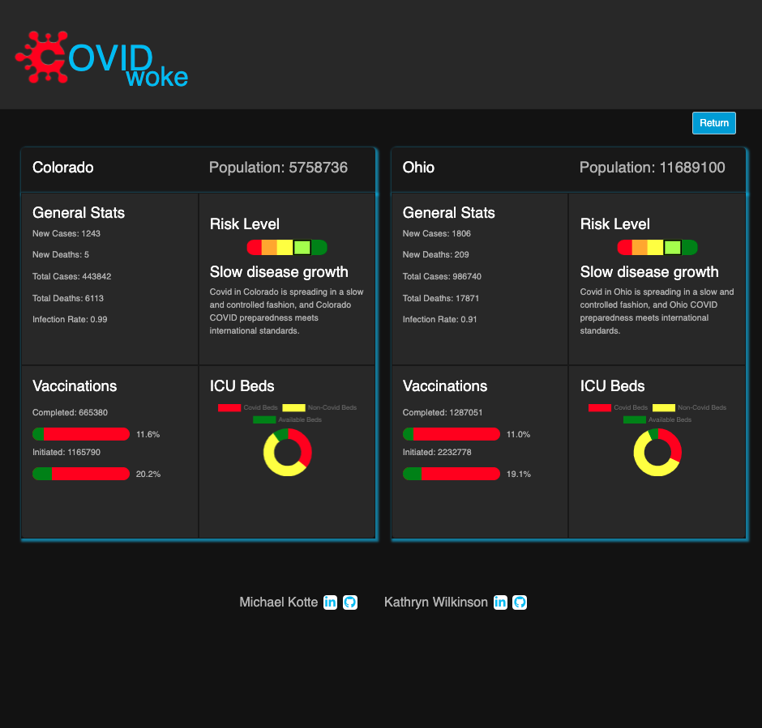

# COVID woke

## Description

COVID woke seeks to elevate the public information environment by presenting necessary information that is accessible and easy to understand. This application uses third party API software technology methods which allow the user to view detailed and complete statistics, and the current COVID climate between multiple regions. Our goal is to empower and inspire humans to live with elevated integrity, mindfulness, and respect.

## Features

Users are able to search specific states and counties for in-depth information about the current situation of the global pandemic. Color coded graphs and charts make it easy to assess the current risk level of the region they search.

### Visuals

### Links

[DeployedApp(GitHub Pages)](<https://mkotte.github.io/project01/>)
[GitHub Repo](<https://github.com/mkotte/project01>)
